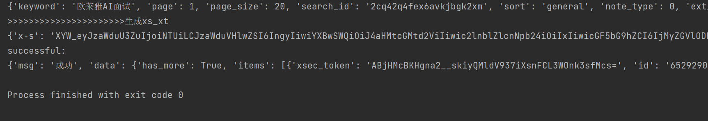
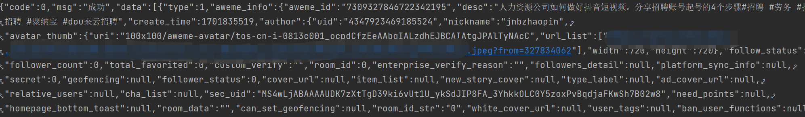
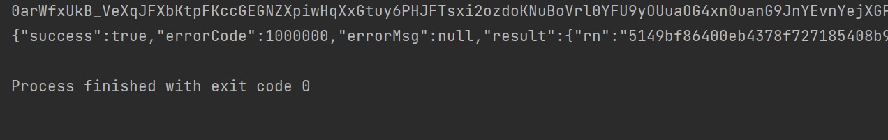
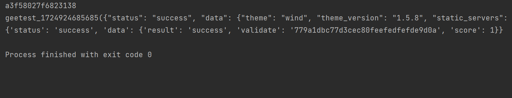
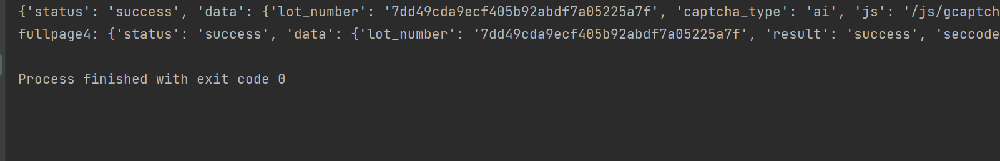
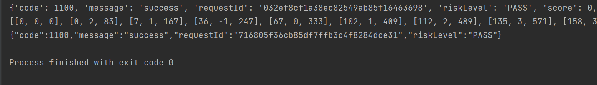

## Table of content  

- [作者联系方式、寻求帮助、合作](#作者联系方式--寻求帮助--合作)
- 
  
  
  
## 小红书加密算法在12.05更新（最新），已成功逆向，能够正常获取到内容！！！
## 声明
**本项目仅供学习交流，严禁用于任何商业和非法用途，非本人使用而产生的纠纷与一切后果均与本人无关。**
 
 
## 作者提供的服务 
  
## 1.XHS   
    

## 2.DY-已支持  
 

## 3.KS-已支持 

## 4.PDD
 
  
## 5.JIYAN3-无感/滑块   
 

## 6.JIYAN4-无感/滑块

## 7.SHUMEI-滑块 
 
 
 
## 作者联系方式 || 寻求帮助 || 合作 
## 以上仅展示部分实例，如有其它接口需求，可定制开发。 
### QQ: 552345133 
### VX: kjq996 
